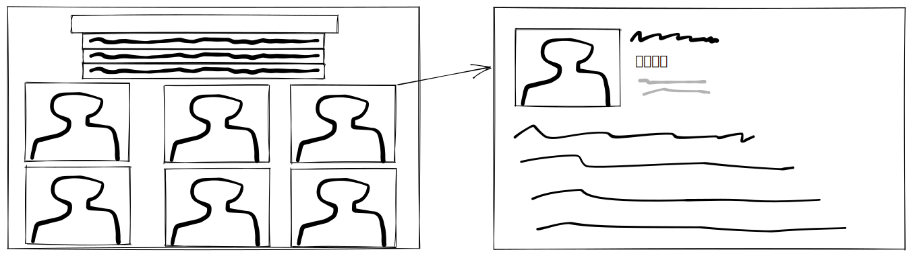

# Front-end assignment

This assignment was estimated to be done in about 2-3 hours, but you can take as much time as you want. Be aware of the deadline specified in the e-mail. When completed, host the project at a place of your choice, and reply to the e-mail. We expect the link to the application and the repository.
## The assignment 

The assignment consists of implementing an e-commerce landing and product details pages, as shown in the sketches below. There must be an auto-complete component listing the best matching results from the text provided. When clicking on a product, the user should get redirected to the product details page. Feel free to add other pages if you judge it necessary.

Suggested, not mandatory, API:
* https://dummyjson.com/docs/products

### What do we expect?
* Creativity
* Stability
* Security
* Readable code
* Good user experience
* Code ready for expansion

### You can
* Use your favourite React framework
* Use your favourite design system or create your own
